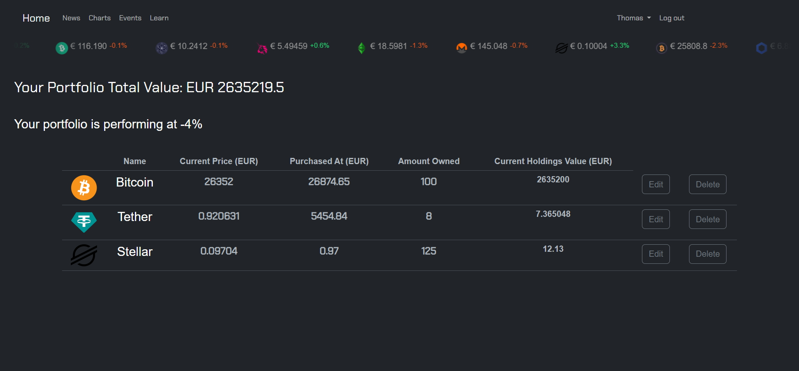

# Crypto Link web application 

### This app helps you to keep track of your investment portfolio and to stay up to date with what is happening in Crypto world!

## Why this project?

### We are crypto investor ourselves and we know how difficult it can be to keep track of your investment especially when you are invested in more than 1 project, so we decided to create a website that takes care of that.

## How to use?

### Users can register and start using the application in just a few clicks. Registered users will be taken to the home page where they can see live Crypto currency data and start forming their portfolios.

### To add coins to portfolio user needs to press +Portfolio button next to crypto currency that they own, then in the pop up form user needs to add amount of that coin that they own and the price at which it was purchased. Coin will be added to your portfolio and will start keeping track of how your investment is progressing. It will compare purchase price with current market price and will give you performance in percentage.

## Users can add coins they are interested in to their watchlist and see how the price is changing since it was added to the watchlist.

## Users can also check and create crypto related events in the events page.

## News page provides live up to date crypto related news from around the world.

## In Charts page users can find current and hystorical crypto data in a form of charts

## Quick Start:

#### Run these commands in your terminal to set up enviroment for the application:

##### npm install in your terminal

##### npm install cloudinary multer multer-storage-cloudinary

#### create an account on cloudinary.com to receive cloudinary name, key and secret

##### create .env file and add enviromental variables with values from previous step for Cloudinary to work:
        *CLOUDINARY_NAME
        *CLOUDINARY_KEY
        *CLOUDINARY_SECRET

#### once setup is finished to start the app run npm run dev in your terminal

#### Created by Paulius Mockevicius (Git pmockevicius) & Sophie White (Git SElizaWhi) 

#### Thank you for your interest in our project

